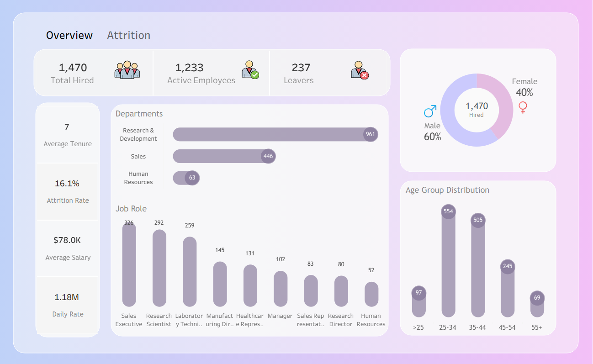
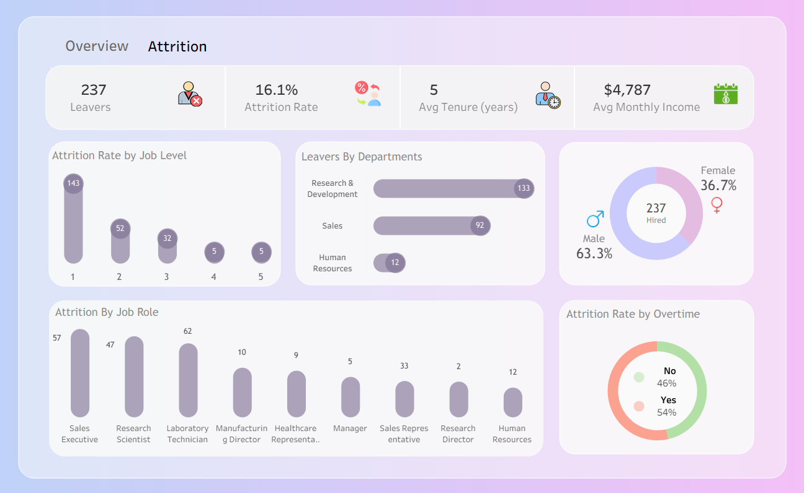

# HR Attrition Analysis Dashboard 

##  Project Overview
This project presents an **HR Analytics Dashboard** focused on **Employee Attrition Analysis**.  
The goal is to help HR teams and decision-makers understand **why employees leave**, identify **risk factors**, and support **data-driven retention strategies**.

The dashboard is built using **Tableau** and covers both **overall workforce insights** and **attrition-specific analysis**.

---

##  Dashboards Included

###  Overview Dashboard
Provides a high-level snapshot of the workforce:

**Key KPIs:**
- Total Hired Employees
- Active Employees
- Total Leavers
- Average Tenure
- Attrition Rate
- Average Salary
- Daily Rate

**Visuals:**
- Employees by Department
- Employees by Job Role
- Age Group Distribution
- Gender Distribution

 *Overview Dashboard*

---

###  Attrition Dashboard
Focuses specifically on employees who left the company:

**Key KPIs:**
- Total Leavers
- Attrition Rate
- Average Tenure (Leavers)
- Average Monthly Income

**Visuals:**
- Attrition Rate by Job Level
- Leavers by Department
- Attrition by Job Role
- Attrition Rate by Overtime
- Gender Distribution of Leavers

*Attrition Dashboard*

---

##  Key Analyses Performed
- **Attrition by Overtime** (Yes vs No)
- **Attrition by Job Satisfaction Level (1–4)**
- **Attrition by Environment Satisfaction**
- **Attrition by Work-Life Balance**
- **Attrition vs Distance From Home** (using bins and trend lines)
- **Attrition by Job Role and Job Level**

---

##  Tools & Technologies
- **Tableau** – Data visualization and dashboard design
- **Excel / CSV Dataset** – Data source
- **GitHub** – Version control and project sharing

---

##  Key Insights (Example)
- Employees working overtime show a **higher attrition rate**
- Lower satisfaction levels (1–2) are associated with **higher attrition**
- Attrition tends to increase as **distance from home** increases
- Certain job roles and departments experience **higher turnover**
---
## Data Source: IBM HR Analytics Employee Attrition & Performance

## Dataset Link: https://www.kaggle.com/datasets/pavansubhasht/ibm-hr-analytics-attrition-dataset
